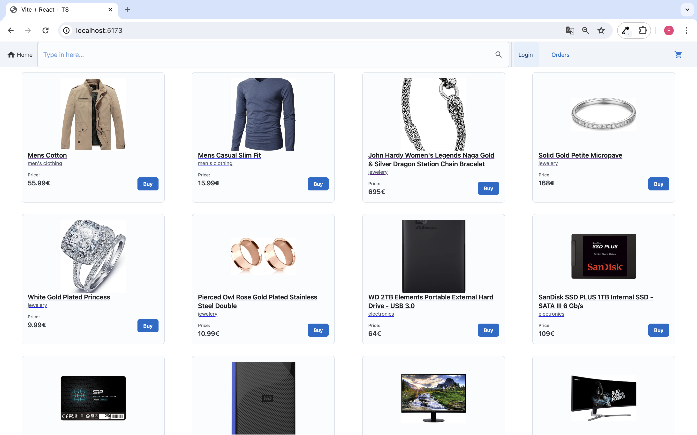
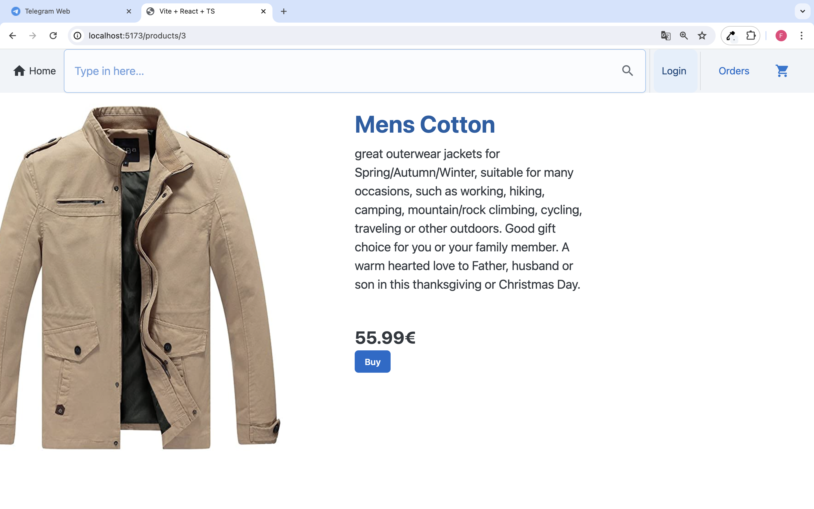
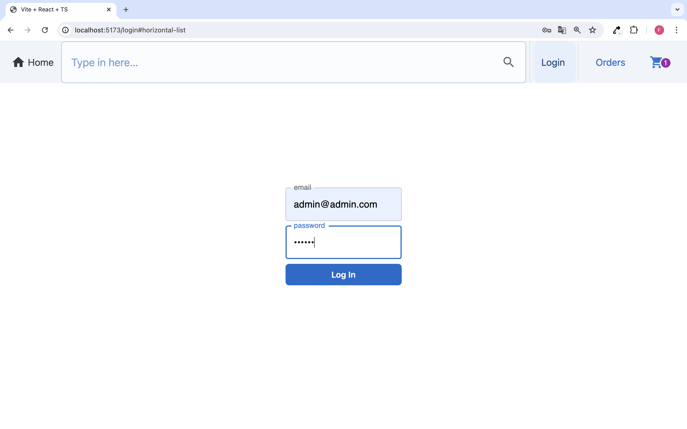
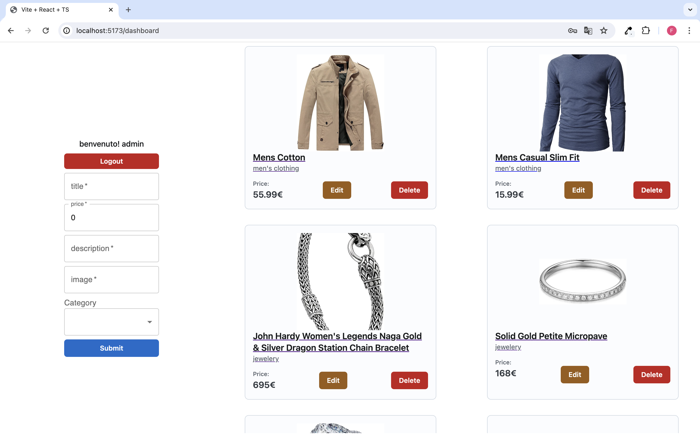
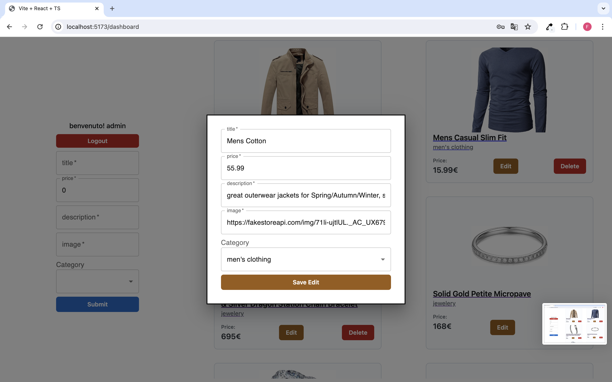
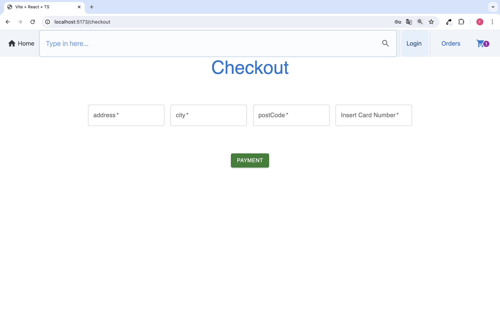
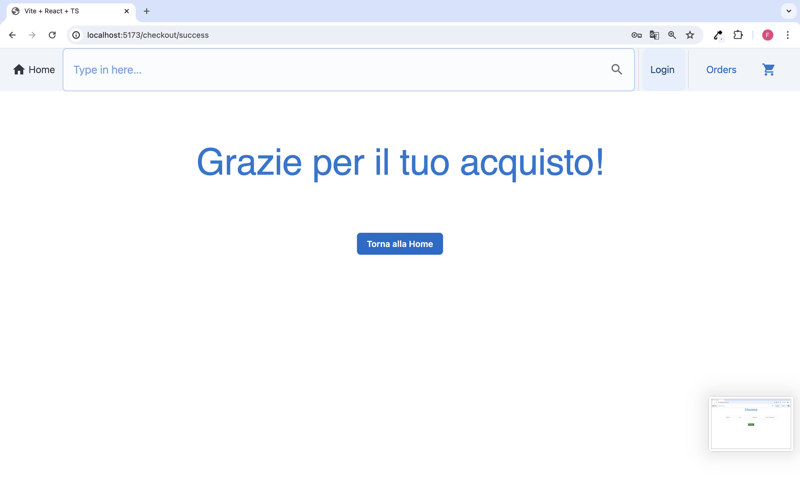

# Project work Code

Il progetto è un ecommerce al quale
hanno partecipato:

- [Marino Francesco](https://github.com/Contessafry)
- [Sancarlo Giorgio](https://github.com/GiorgioSancarlo)
- [Governale Samuele Alessandro](https://github.com/Alessandroromir)

## Features

- Lista prodotti
- Funzione di login
- Aggiungi al carrello
- Rimuovi singolo prodotto dal carrello
- Rimuovi tutti i prodotti dal carrello
- Checkout
- schermata di pagamento
- dashboard (accessibile solo da Admin)
- Post e put dei prodotti
- Delete prodotti
- Funzione di ricerca
- Salvataggio ordini

## Pages

- Home page
  
- Dynamic product page
  
- Login page
  
- Dashboard page
  

- Checkout page
  
- Checkout success
  

## stack di sviluppo :

- [React](https://react.dev/)
- [Material Ui](https://mui.com/)
- [Json server](https://github.com/typicode/json-server)
